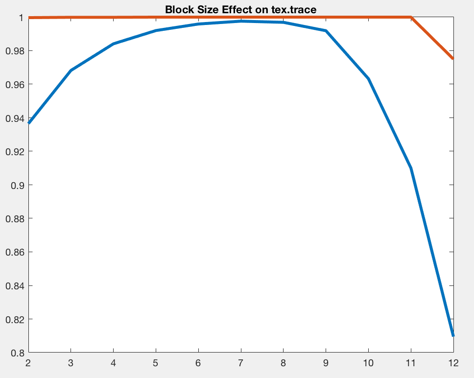

#Cache Simulator

- Author: LIN JIANING
- Date: 2017.12
- Course: Computer Architecture
- Hardware: MacBook Pro 
- Language: C
- IDE: CLion
- Description: Implemented a trace-driven cache simulator, and used it to evaluate the performance of different cache architecture features. The project is described in detail in sim.pdf.

### Usage

use `make` to build the program in `/attachment/code/` folder

##Impact of Cache Size
**1. test trace:** spice.trace  

|CS|Hit rate of data|Hit rate of instructions|
|:---:|:--:|:---:|
|4| 0.0604| 0.0000|
|8| 0.1454| 0.0000|
|16| 0.2622| 0.0034|
|32| 0.3659| 0.0101|
|64| 0.4521| 0.2636|
|128| 0.5395| 0.3687|
|256| 0.7243| 0.4548|
|512| 0.8448| 0.5368|
|1024| 0.9080| 0.7548|
|2048| 0.9532| 0.8620|
|4096| 0.9656| 0.9057|
|8192| 0.9726| 0.9747|
|16384| 0.9806| 0.9864|
|32768| 0.9806| 0.9885|
|65536| 0.9806| 0.9885|
|131072| 0.9806| 0.9885|

****

**2. test trace:** cc.trace

|CS|Hit rate of data|Hit rate of instructions|
|:---:|:---:|:---:|
|4| 0.0676| 0.0000|
|8| 0.1373| 0.0000|
|16| 0.2229| 0.0047|
|32| 0.3330| 0.0353|
|64| 0.4366| 0.1194|

|CS|Hit rate of data|Hit rate of instructions|
|:---:|:---:|:---:|
|128| 0.5502| 0.2023|
|256| 0.6583| 0.3010|
|512| 0.7523| 0.3993|
|1024| 0.8344| 0.4736|
|2048| 0.8766| 0.5930|
|4096| 0.9105| 0.7360|
|8192| 0.9437| 0.8684|
|16384| 0.9555| 0.9360|
|32768| 0.9606| 0.9492|
|65536| 0.9618| 0.9511|
|131072| 0.9618| 0.9588|
|262144| 0.9618| 0.9588|

**3. test trace:** tex.trace

|CS|Hit rate of data|Hit rate of instructions|
|:---:|:---:|:---:|
|4| 0.0001| 0.0000|
|8| 0.2222| 0.0000|
|16| 0.3333| 0.0000|
|32| 0.5713| 0.1874|
|64| 0.9204| 0.1874|
|128| 0.9365| 0.1874|
|256| 0.9365| 0.5433|
|512| 0.9365| 0.9991|
|1024| 0.9365| 0.9997|
|2048| 0.9365| 0.9997|
|4096| 0.9365| 0.9997|

|CS|Hit rate of data|Hit rate of instructions|
|:---:|:---:|:---:|
|8192| 0.9365| 0.9997|
|16384| 0.9365| 0.9997|
|32768| 0.9595| 0.9997|
|65536| 0.9595| 0.9997|
|131072| 0.9595| 0.9997|
|262144| 0.9595| 0.9997|

###Answer to Questions:

1. **Explain what this experiment is doing, and how it works. Also, explain the significance of
the features in the hit-rate vs. cache size plots.**  
***· Answer:***  
在这个实验中，我们尝试设计并实现了一个简单的Cache仿真器，实现了Block size、Cache size、Associativity，WB&WA可调，I/D Cache split等功能。利用这个仿真器我们可以对Cache进行仿真，测试不同的Cache对性能的影响，从而加深对Cache的理解。对于第一组测试来说，我们考察了Cache size对Cache性能的影响，我们可以直观的发现在Cache size逐渐变大的过程中Hit rate也在逐步变大，并最终保持稳定，这是由于在Cache size变大后能够满足trace中所有地址数据的存放，而不需要replacement。而对于不同的trace文件，稳定的Cache size也有所不同。
2. **What is the total instruction working set size and data working set size for each of the three
sample traces?**  
***· Answer:***

||spice.trace|cc.trace|tex.trace|
|:-:|:-:|:-:|:-:|
|IWSS|16384|65536|65536|
|DWSS|32768|131072|1024|
##Impact of Bache Size
**1. test trace:** spice.trace

|BS|Hit rate of data|Hit rate of instructions|
|:---:|:---:|:---:|
|4| 0.9701| 0.9519|
|8| 0.9830| 0.9722|
|16| 0.9886| 0.9826|

|BS|Hit rate of data|Hit rate of instructions|
|:---:|:---:|:---:|
|32| 0.9912| 0.9885|
|64| 0.9855| 0.9916|
|128| 0.9814| 0.9935|
|256| 0.9763| 0.9946|
|512| 0.9564| 0.9955|
|1024| 0.9415| 0.9955|
|2048| 0.8968| 0.9889|
|4096| 0.7947| 0.9864|

**2. test trace:** cc.trace

|BS|Hit rate of data|Hit rate of instructions|
|:---:|:---:|:---:|
|4| 0.9339| 0.8225|
|8| 0.9544| 0.8982|
|16| 0.9646| 0.9368|
|32| 0.9695| 0.9578|
|64| 0.9690| 0.9696|
|128| 0.9620| 0.9772|
|256| 0.9508| 0.9820|
|512| 0.9267| 0.9859|
|1024| 0.8842| 0.9872|
|2048| 0.8175| 0.9885|
|4096| 0.7062| 0.9877|

**3. test trace:** tex.trace

|BS|Hit rate of data|Hit rate of instructions|
|:---:|:---:|:---:|
|4| 0.9365| 0.9997|
|8| 0.9682| 0.9999|
|16| 0.9841| 0.9999|
|32| 0.9920| 1.0000|
|64| 0.9959| 1.0000|
|128| 0.9976| 1.0000|
|256| 0.9969| 1.0000|
|512| 0.9919| 1.0000|
|1024| 0.9633| 1.0000|
|2048| 0.9100| 1.0000|
|4096| 0.8095| 0.9750|

###Answer to Questions:

1. **Explain why the hit rate vs. block size plot has the shape that it does. In particular, explain
the relevance of spatial locality to the shape of this curve.**    
***· Answer:***  
Block size和Hit rate的关系是一个上凸的函数，随着块大小的增加，由于程序的空间局部性起主要作用，同一块中数据的利用率比较高。因此，Cache的命中率开始升高。但如果块变得过大的话，会减少装入Cache的总行数，而且，也会使得离所访问的位置较远的块被再次使用的概率变小。因此，这种增加趋势在某一个“最佳块大小”处使Cache命中率达到最大值。
2. **What is the optimal block size (consider instruction and data references separately) for each
trace?**  
***· Answer:***  

i.Data Block Size

||spice.trace|cc.trace|tex.trace|
|:-:|:-:|:-:|:-:|
|BS|32|32|128|

ii.Instructions Block Size

||spice.trace|cc.trace|tex.trace|
|:-:|:-:|:-:|:-:|
|BS|512|2048|32-2048|

3. **Is the optimal block size for instruction and data references different? What does this tell
you about the nature of instruction references versus data references?**  
***· Answer:***  
我们可以很明显的看出相比之下指令Cache在Block size增大到很大的时候才会达到极限，这说明指令的重用率比数据的重用率要高很多。
##Impact of Associativity
**1. test trace:** spice.trace

|ASSOC|Hit rate of data|Hit rate of instructions|
|:---:|:---:|:---:|
|1| 0.9608| 0.9885|
|2| 0.9814| 0.9935|
|4| 0.9951| 0.9945|
|8| 0.9960| 0.9943|
|16| 0.9964| 0.9942|
|32| 0.9966| 0.9942|
|64| 0.9966| 0.9941|

**2. test trace:** cc.trace

|ASSOC|Hit rate of data|Hit rate of instructions|
|:---:|:---:|:---:|
|1| 0.9385| 0.9737|
|2| 0.9620| 0.9772|
|4| 0.9702| 0.9791|
|8| 0.9737| 0.9791|
|16| 0.9750| 0.9798|
|32| 0.9756| 0.9802|
|64| 0.9755| 0.9801|

**3. test trace:** tex.trace

|ASSOC|Hit rate of data|Hit rate of instructions|
|:---:|:---:|:---:|
|1| 0.9868| 1.0000|
|2| 0.9976| 1.0000|
|4| 0.9980| 1.0000|
|8| 0.9980| 1.0000|
|16| 0.9980| 1.0000|
|32| 0.9980| 1.0000|
|64| 0.9980| 1.0000|

###Answer to Questions:

1. **Explain why the hit rate vs. associativity plot has the shape that it does.**  
***· Answer:***  
随着Associativity的增大，cache的性能逐渐变好，即Hit rate逐渐变大，这是由于在其他参数不变的情况下，Associativity的增大使得在同一个set里可以存放的tag数目变多，让Hit的情况变多。
2. **Is there a difference between the plots for instruction and data references? What does this
tell you about the difference in impact of associativity on instruction versus data references?**  
***· Answer:***  
Associativity对Data cache的影响更大，对Instruction cache的影响比较小。这是由于数据的局部性原理导致频繁使用的数据在同一个区域内，因此Associativity的增大可以改善数据的访问成功率。

##Impact of WB/WT and WA/NWA Policies
**test trace:** spice.trace

**i. impact of WB policy**

|WB|ASSOC|BS|CS|DF|CB|
|:---:|:---:|:---:|:---:|:---:|:---:|
|1|8| 32| 16384| 21064| 7118|
|1|16| 32| 16384| 19560| 7030|
|1|16| 64| 16384| 24464| 7678|
|1|16| 32| 8192| 73888| 8191|
|0|8| 32| 16384| 21064| 66538|
|0|16| 32| 16384| 19560| 66538|
|0|16| 64| 16384| 24464| 66538|
|0|16| 32| 8192| 73888| 66538|
###Answer to Questions:
1. **Which cache has the smaller memory traffic, the write-through cache or the write-back cache?
Why?**  
***· Answer:***  
Write-back cache有更小的memory traffic。因为write-back cache不需要频繁的写回memory，因此访问内存的次数更少。
2. **Is there any scenario under which your answer to the question above would flip? Explain.**  
***· Answer:***  
当write-back cache频繁的replacement的时候，会导致其访问内存的次数大大增加，超过write-through cache。

**ii. impact of WA policy**

|WA|ASSOC|BS|CS|DF|CB|
|:---:|:---:|:---:|:---:|:---:|:---:|
|0|8| 32| 8192| 72504| 8095|
|0|8| 32| 16384| 21064| 7118|
|0|8| 64| 8192| 113520| 8912|
|0|8| 64| 16384| 32784| 7717|
|0|16| 32| 8192| 73888| 8191|
|0|16| 32| 16384| 19560| 7030|
|0|16| 64| 8192| 115120| 8884|
|0|16| 64| 16384| 24464| 7678|
|1|8| 32| 8192| 74704| 5456|
|1|8| 32| 16384| 22184| 4136|
|1|8| 64| 8192| 115808| 6656|
|1|8| 64| 16384| 34416| 5280|
|1|16| 32| 8192| 75976| 5496|
|1|16| 32| 16384| 20920| 4304|
|1|16| 64| 8192| 117360| 6624|
|1|16| 64| 16384| 26048| 5184|
###Answer to Questions:
1. **Which cache has the smaller memory traffic, the write-allocate or the write-no-allocate cache?
Why?**  
***· Answer:***  
write-allocate cache有更小的memory traffic，这是由于write-allocate cache，会利用cache来暂时存储更改过的数据或指令，不用每次都去内存里取，因此，在频繁使用的情况下会有个好的效率。

2. I**s there any scenario under which your answer to the question above would flip? Explain.**  
***· Answer:***  
当write-allocate cache频繁的miss的时候，会导致其访问内存的次数大大增加，超过write-no-allocate cache。